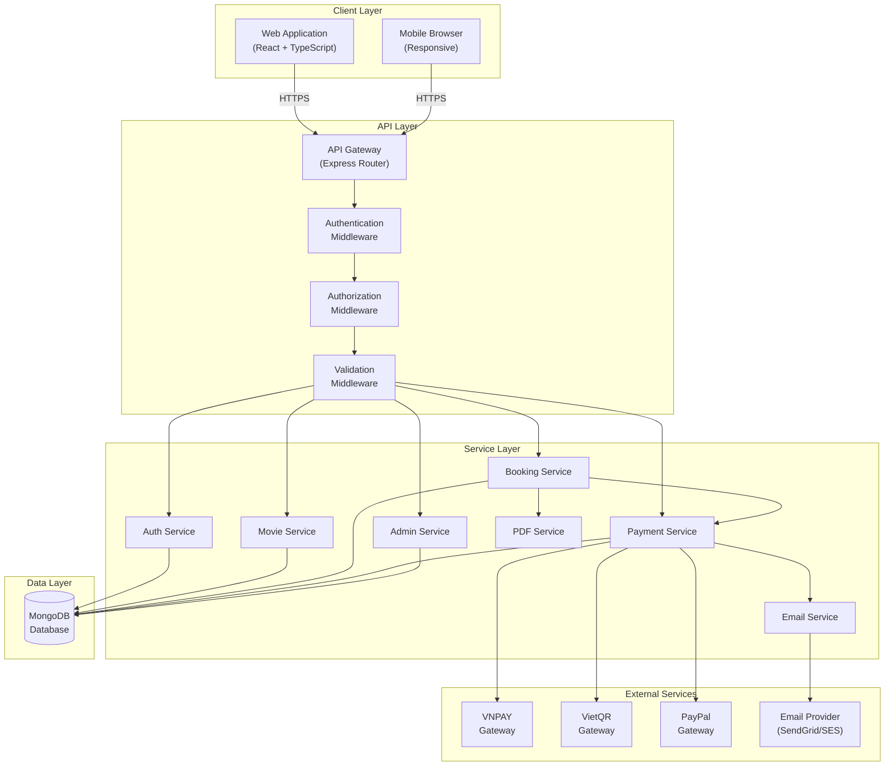
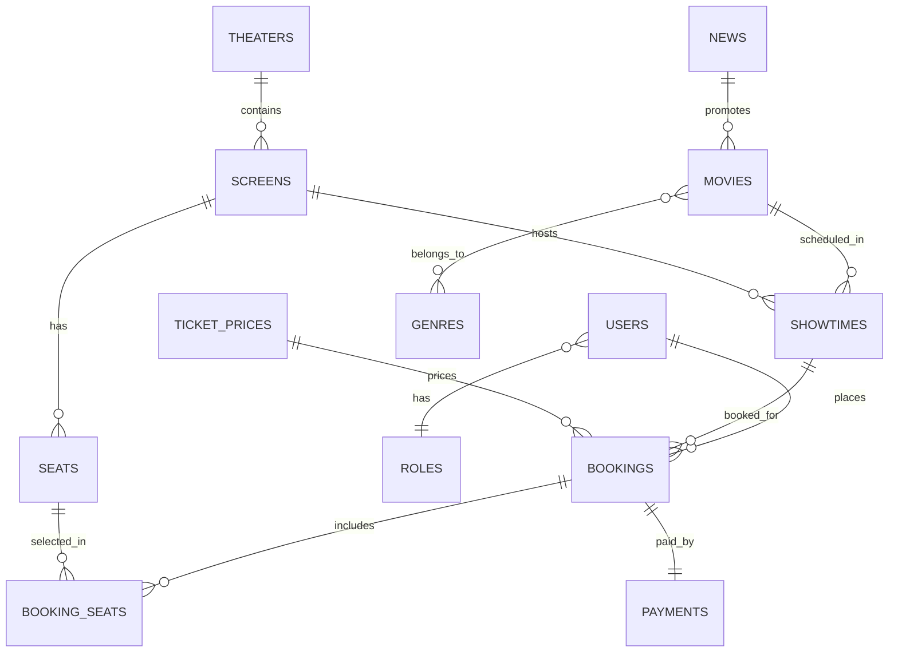
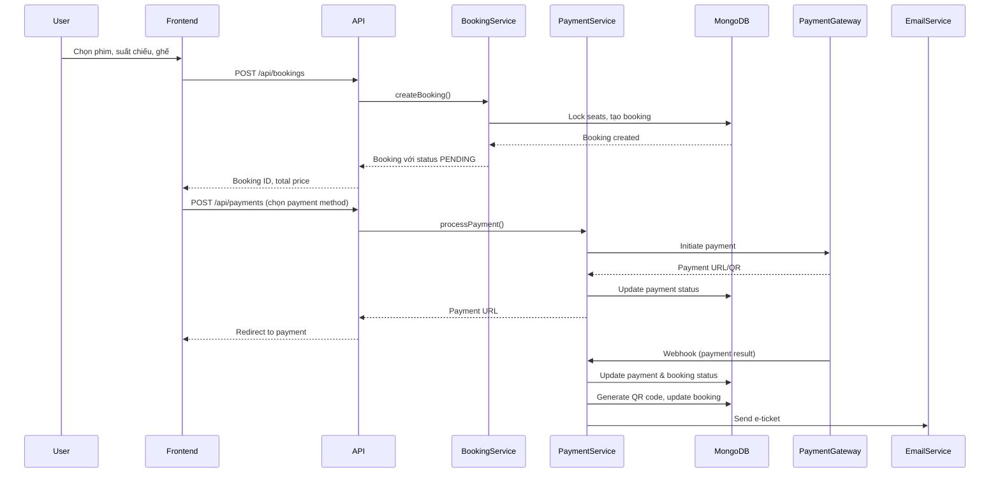

# System Design & Architecture - Hệ thống Đặt Vé Xem Phim

## Architecture Overview
**Cấu trúc hệ thống cấp cao**

### Kiến trúc tổng quan



### Các thành phần chính và trách nhiệm

1. **Client Layer (Frontend)**
   - **Web Application**: React + TypeScript, responsive design
   - Trách nhiệm: Hiển thị UI, xử lý user interactions, gọi API

2. **API Layer (Backend)**
   - **API Gateway**: Express router, định tuyến requests
   - **Middleware**: Authentication, Authorization, Validation, Error handling
   - Trách nhiệm: Xử lý HTTP requests, validate input, authenticate users

3. **Service Layer**
   - **Auth Service**: Đăng ký, đăng nhập, quản lý JWT tokens
   - **Movie Service**: Quản lý phim, thể loại, lịch chiếu
   - **Booking Service**: Xử lý đặt vé, chọn ghế, lock ghế
   - **Payment Service**: Tích hợp payment gateways, xử lý thanh toán
   - **Admin Service**: Quản lý phim, rạp, báo cáo doanh thu
   - **Email Service**: Gửi email xác thực, thông báo
   - **PDF Service**: Sinh vé điện tử dạng PDF
   - Trách nhiệm: Business logic, xử lý nghiệp vụ

4. **Data Layer**
   - **MongoDB**: NoSQL database lưu trữ toàn bộ dữ liệu
   - Trách nhiệm: Lưu trữ và truy vấn dữ liệu

5. **External Services**
   - **Payment Gateways**: VNPAY, VietQR, PayPal
   - **Email Provider**: SendGrid, AWS SES, hoặc SMTP
   - Trách nhiệm: Xử lý thanh toán và gửi email

### Technology Stack

- **Frontend**: React 19, TypeScript, Vite, TailwindCSS, React Router
- **Backend**: Node.js, Express 5, JavaScript (ES6+)
- **Database**: MongoDB với Mongoose ODM
- **Authentication**: JWT (jsonwebtoken), bcryptjs
- **Payment**: VNPAY SDK, VietQR API, PayPal SDK
- **Email**: Nodemailer hoặc SendGrid
- **PDF**: PDFKit hoặc Puppeteer
- **QR Code**: qrcode library

## Data Models
**Dữ liệu cần quản lý**

### ERD - Mối quan hệ giữa các Collections



### MongoDB Schemas (Mongoose)

#### 1. Users Collection

```javascript
{
  _id: ObjectId,
  firstName: String (required),
  lastName: String (required),
  email: String (required, unique, lowercase),
  password: String (required, hashed),
  phone: String,
  address: String,
  avatar: String (URL),
  role: ObjectId (ref: 'Role', default: 'user'),
  status: String (enum: ['ACTIVE', 'BLOCKED'], default: 'ACTIVE'),
  emailVerified: Boolean (default: false),
  emailVerificationToken: String,
  resetPasswordToken: String,
  resetPasswordExpires: Date,
  createdAt: Date (default: Date.now),
  updatedAt: Date (default: Date.now)
}
```

**Indexes**: `email`, `phone`, `role`

#### 2. Roles Collection

```javascript
{
  _id: ObjectId,
  roleName: String (required, unique, enum: ['admin', 'user']),
  permissions: [String],
  createdAt: Date,
  updatedAt: Date
}
```

#### 3. Movies Collection

```javascript
{
  _id: ObjectId,
  title: String (required),
  description: String,
  author: String (director/producer),
  image: String (poster URL, required),
  trailer: String (video URL),
  type: String (enum: ['2D', '3D'], default: '2D'),
  duration: Number (minutes, required),
  releaseDate: Date (required),
  genres: [ObjectId] (ref: 'Genre'),
  status: String (enum: ['COMING_SOON', 'NOW_SHOWING', 'STOPPED'], default: 'COMING_SOON'),
  rating: Number (min: 0, max: 10),
  createdAt: Date,
  updatedAt: Date
}
```

**Indexes**: `title`, `status`, `releaseDate`, `genres`

#### 4. Genres Collection

```javascript
{
  _id: ObjectId,
  genreName: String (required, unique),
  description: String,
  createdAt: Date,
  updatedAt: Date
}
```

#### 5. Theaters Collection

```javascript
{
  _id: ObjectId,
  name: String (required),
  location: String (address, required),
  phone: String,
  email: String,
  website: String,
  status: String (enum: ['ACTIVE', 'INACTIVE'], default: 'ACTIVE'),
  createdAt: Date,
  updatedAt: Date
}
```

**Indexes**: `name`, `location`

#### 6. Screens Collection

```javascript
{
  _id: ObjectId,
  name: String (required),
  theaterId: ObjectId (ref: 'Theater', required),
  seatCapacity: Number (required),
  screenType: String (enum: ['STANDARD', 'IMAX', '4DX']),
  status: String (enum: ['ACTIVE', 'MAINTENANCE'], default: 'ACTIVE'),
  createdAt: Date,
  updatedAt: Date
}
```

**Indexes**: `theaterId`, `name`

#### 7. Seats Collection

```javascript
{
  _id: ObjectId,
  seatNumber: String (required, e.g., 'A1', 'B5'),
  screenId: ObjectId (ref: 'Screen', required),
  row: String (required),
  column: Number (required),
  type: String (enum: ['STANDARD', 'VIP', 'SWEETBOX'], default: 'STANDARD'),
  isVariable: Boolean (default: false),
  isActive: Boolean (default: true),
  createdAt: Date,
  updatedAt: Date
}
```

**Indexes**: `screenId`, `seatNumber`, `screenId + seatNumber` (compound unique)

#### 8. Showtimes Collection

```javascript
{
  _id: ObjectId,
  movieId: ObjectId (ref: 'Movie', required),
  screenId: ObjectId (ref: 'Screen', required),
  startTime: Date (required),
  endTime: Date (required, calculated: startTime + movie.duration),
  price: Number (override price if needed),
  status: String (enum: ['SCHEDULED', 'ONGOING', 'COMPLETED', 'CANCELLED'], default: 'SCHEDULED'),
  createdAt: Date,
  updatedAt: Date
}
```

**Indexes**: `movieId`, `screenId`, `startTime`, `screenId + startTime` (compound for conflict check)

#### 9. Bookings Collection

```javascript
{
  _id: ObjectId,
  userId: ObjectId (ref: 'User', required),
  showtimeId: ObjectId (ref: 'Showtime', required),
  totalSeats: Number (required),
  totalPrice: Number (required),
  bookingStatus: String (enum: ['PENDING', 'CONFIRMED', 'CANCELLED', 'CHECKED_IN', 'EXPIRED'], default: 'PENDING'),
  seats: [{
    seatId: ObjectId (ref: 'Seat', required),
    seatNumber: String,
    price: Number
  }],
  qrCode: String (generated after payment),
  expiresAt: Date (5 minutes from creation for PENDING),
  createdAt: Date,
  updatedAt: Date
}
```

**Indexes**: `userId`, `showtimeId`, `bookingStatus`, `expiresAt` (TTL index for cleanup)

#### 10. Payments Collection

```javascript
{
  _id: ObjectId,
  bookingId: ObjectId (ref: 'Booking', required, unique),
  userId: ObjectId (ref: 'User', required),
  paymentMethod: String (enum: ['VNPAY', 'VIETQR', 'PAYPAL', 'WALLET'], required),
  amount: Number (required),
  currency: String (default: 'VND'),
  paymentStatus: String (enum: ['PENDING', 'COMPLETED', 'FAILED', 'REFUNDED'], default: 'PENDING'),
  transactionId: String (from payment gateway),
  gatewayResponse: Object (raw response from gateway),
  paymentTime: Date,
  refundAmount: Number,
  refundTime: Date,
  createdAt: Date,
  updatedAt: Date
}
```

**Indexes**: `bookingId`, `userId`, `paymentStatus`, `transactionId`

#### 11. TicketPrices Collection

```javascript
{
  _id: ObjectId,
  typeSeat: String (enum: ['STANDARD', 'VIP', 'SWEETBOX'], required),
  typeMovie: String (enum: ['2D', '3D'], required),
  price: Number (required),
  dayType: Number (enum: [0, 1], default: 0, 0=weekday, 1=weekend/holiday),
  startTime: String (HH:mm format, e.g., '09:00'),
  endTime: String (HH:mm format, e.g., '17:00'),
  isActive: Boolean (default: true),
  createdAt: Date,
  updatedAt: Date
}
```

**Indexes**: `typeSeat + typeMovie + dayType` (compound for price lookup)

#### 12. News Collection

```javascript
{
  _id: ObjectId,
  title: String (required),
  content: String (required),
  image: String (URL),
  type: String (enum: ['NEWS', 'PROMOTION', 'EVENT'], default: 'NEWS'),
  status: String (enum: ['DRAFT', 'PUBLISHED', 'ARCHIVED'], default: 'DRAFT'),
  publishedAt: Date,
  relatedMovies: [ObjectId] (ref: 'Movie'),
  createdAt: Date,
  updatedAt: Date
}
```

**Indexes**: `type`, `status`, `publishedAt`

### Data Flow



## API Design
**Các thành phần giao tiếp như thế nào?**

### RESTful API Endpoints

#### Authentication APIs

```
POST   /api/auth/register          - Đăng ký tài khoản
POST   /api/auth/login             - Đăng nhập
POST   /api/auth/logout            - Đăng xuất
POST   /api/auth/verify-email      - Xác thực email
POST   /api/auth/forgot-password   - Quên mật khẩu
POST   /api/auth/reset-password    - Đặt lại mật khẩu
GET    /api/auth/me                - Lấy thông tin user hiện tại
```

#### Movie APIs (Public)

```
GET    /api/movies                 - Danh sách phim (có filter, search, pagination)
GET    /api/movies/:id              - Chi tiết phim
GET    /api/movies/:id/showtimes   - Lịch chiếu của phim
GET    /api/genres                  - Danh sách thể loại
GET    /api/theaters                - Danh sách rạp
GET    /api/theaters/:id            - Chi tiết rạp
GET    /api/theaters/:id/screens   - Danh sách phòng chiếu của rạp
GET    /api/showtimes               - Lịch chiếu (filter by movie, theater, date)
GET    /api/showtimes/:id/seats     - Sơ đồ ghế của suất chiếu
GET    /api/news                    - Tin tức và khuyến mãi
```

#### Booking APIs (User only)

```
POST   /api/bookings                - Tạo booking (chọn ghế)
GET    /api/bookings                - Lịch sử đặt vé của user
GET    /api/bookings/:id             - Chi tiết booking
PUT    /api/bookings/:id/cancel      - Hủy vé
GET    /api/bookings/:id/ticket      - Tải vé điện tử (PDF)
```

#### Payment APIs (User only)

```
POST   /api/payments                 - Tạo payment request
POST   /api/payments/:id/verify      - Verify payment (sau khi gateway callback)
GET    /api/payments                 - Lịch sử thanh toán
GET    /api/payments/:id              - Chi tiết payment
```

#### User Profile APIs (User only)

```
GET    /api/users/profile            - Lấy thông tin profile
PUT    /api/users/profile            - Cập nhật profile
POST   /api/users/avatar             - Upload avatar
GET    /api/users/favorites          - Danh sách phim yêu thích
POST   /api/users/favorites/:movieId - Thêm phim yêu thích
DELETE /api/users/favorites/:movieId - Xóa phim yêu thích
```

#### Admin - Movie Management APIs

```
POST   /api/admin/movies             - Thêm phim mới
GET    /api/admin/movies             - Danh sách phim (admin view)
GET    /api/admin/movies/:id         - Chi tiết phim
PUT    /api/admin/movies/:id         - Cập nhật phim
DELETE /api/admin/movies/:id         - Xóa phim
POST   /api/admin/genres             - Thêm thể loại
PUT    /api/admin/genres/:id         - Cập nhật thể loại
DELETE /api/admin/genres/:id         - Xóa thể loại
```

#### Admin - Theater Management APIs

```
POST   /api/admin/theaters           - Thêm rạp
GET    /api/admin/theaters           - Danh sách rạp
PUT    /api/admin/theaters/:id       - Cập nhật rạp
DELETE /api/admin/theaters/:id       - Xóa rạp
POST   /api/admin/theaters/:id/screens - Thêm phòng chiếu
PUT    /api/admin/screens/:id        - Cập nhật phòng chiếu
DELETE /api/admin/screens/:id        - Xóa phòng chiếu
POST   /api/admin/screens/:id/seats  - Thêm ghế
PUT    /api/admin/seats/:id          - Cập nhật ghế
DELETE /api/admin/seats/:id          - Xóa ghế
```

#### Admin - Showtime Management APIs

```
POST   /api/admin/showtimes          - Tạo lịch chiếu
GET    /api/admin/showtimes          - Danh sách lịch chiếu
PUT    /api/admin/showtimes/:id      - Cập nhật lịch chiếu
DELETE /api/admin/showtimes/:id      - Xóa lịch chiếu
GET    /api/admin/showtimes/conflicts - Kiểm tra xung đột
```

#### Admin - Pricing APIs

```
POST   /api/admin/ticket-prices       - Thêm giá vé
GET    /api/admin/ticket-prices       - Danh sách giá vé
PUT    /api/admin/ticket-prices/:id   - Cập nhật giá vé
DELETE /api/admin/ticket-prices/:id   - Xóa giá vé
```

#### Admin - Booking & Payment Management APIs

```
GET    /api/admin/bookings            - Danh sách bookings (filter, search)
GET    /api/admin/bookings/:id        - Chi tiết booking
PUT    /api/admin/bookings/:id/status - Cập nhật trạng thái booking
GET    /api/admin/payments            - Danh sách payments
GET    /api/admin/payments/:id        - Chi tiết payment
POST   /api/admin/bookings/:id/checkin - Check-in vé tại rạp
```

#### Admin - User Management APIs

```
GET    /api/admin/users               - Danh sách users
GET    /api/admin/users/:id           - Chi tiết user
PUT    /api/admin/users/:id           - Cập nhật user
PUT    /api/admin/users/:id/block     - Chặn/mở chặn user
GET    /api/admin/users/:id/bookings  - Lịch sử đặt vé của user
```

#### Admin - Reports APIs

```
GET    /api/admin/reports/revenue     - Báo cáo doanh thu (filter by date, movie, theater)
GET    /api/admin/reports/occupancy   - Tỷ lệ lấp đầy phòng chiếu
GET    /api/admin/reports/export      - Export báo cáo (CSV/Excel)
```

#### Admin - News Management APIs

```
POST   /api/admin/news                - Thêm tin tức
GET    /api/admin/news                - Danh sách tin tức
PUT    /api/admin/news/:id            - Cập nhật tin tức
DELETE /api/admin/news/:id            - Xóa tin tức
```

### Request/Response Formats

#### Standard Response Format

```json
{
  "success": true,
  "data": {},
  "message": "Success message",
  "pagination": {
    "page": 1,
    "limit": 10,
    "total": 100,
    "totalPages": 10
  }
}
```

#### Error Response Format

```json
{
  "success": false,
  "error": {
    "code": "ERROR_CODE",
    "message": "Error message",
    "details": {}
  }
}
```

### Authentication/Authorization

- **Authentication**: JWT tokens
  - Token được gửi trong header: `Authorization: Bearer <token>`
  - Token có thời hạn (ví dụ: 24h cho access token, 7 days cho refresh token)
  
- **Authorization**: Role-based (RBAC)
  - Middleware kiểm tra role: `admin` hoặc `user`
  - Admin có quyền truy cập tất cả endpoints
  - User chỉ truy cập được endpoints dành cho user

## Component Breakdown
**Các khối xây dựng chính**

### Frontend Components

#### Pages
- `HomePage`: Trang chủ, danh sách phim
- `MovieDetailPage`: Chi tiết phim, lịch chiếu
- `BookingPage`: Chọn ghế, đặt vé
- `PaymentPage`: Thanh toán
- `BookingHistoryPage`: Lịch sử đặt vé
- `ProfilePage`: Quản lý profile
- `LoginPage` / `RegisterPage`: Authentication
- `AdminDashboard`: Dashboard admin
- `AdminMoviesPage`: Quản lý phim
- `AdminTheatersPage`: Quản lý rạp
- `AdminShowtimesPage`: Quản lý lịch chiếu
- `AdminReportsPage`: Báo cáo doanh thu

#### Components
- `MovieCard`: Card hiển thị phim
- `SeatMap`: Sơ đồ ghế ngồi
- `ShowtimeSelector`: Chọn suất chiếu
- `PaymentMethodSelector`: Chọn phương thức thanh toán
- `ETicketViewer`: Xem vé điện tử
- `RevenueChart`: Biểu đồ doanh thu

#### Services/Hooks
- `useAuth`: Authentication hooks
- `useMovies`: Movie data hooks
- `useBooking`: Booking logic hooks
- `usePayment`: Payment processing hooks
- `apiClient`: API client với interceptors

### Backend Services/Modules

#### Controllers
- `auth.controller.js`: Xử lý authentication requests
- `movie.controller.js`: Xử lý movie requests
- `booking.controller.js`: Xử lý booking requests
- `payment.controller.js`: Xử lý payment requests
- `admin.controller.js`: Xử lý admin requests
- `user.controller.js`: Xử lý user profile requests

#### Services
- `auth.service.js`: Business logic cho authentication
- `movie.service.js`: Business logic cho movies
- `booking.service.js`: Business logic cho bookings, seat locking
- `payment.service.js`: Tích hợp payment gateways
- `admin.service.js`: Business logic cho admin operations
- `email.service.js`: Gửi email
- `pdf.service.js`: Sinh PDF tickets
- `price.service.js`: Tính giá vé

#### Models (Mongoose)
- Tất cả các models tương ứng với MongoDB schemas

#### Middleware
- `auth.middleware.js`: Xác thực JWT token
- `authorize.middleware.js`: Kiểm tra quyền truy cập
- `validation.middleware.js`: Validate request data
- `error.middleware.js`: Xử lý lỗi tập trung
- `cors.middleware.js`: CORS configuration

#### Utils
- `error.util.js`: Error classes và helpers
- `response.util.js`: Standard response formatters
- `jwt.util.js`: JWT helpers
- `qr.util.js`: QR code generation

### Third-party Integrations

- **Payment Gateways**: VNPAY SDK, VietQR API, PayPal SDK
- **Email Service**: Nodemailer với SMTP hoặc SendGrid API
- **PDF Generation**: PDFKit hoặc Puppeteer
- **QR Code**: qrcode npm package

## Design Decisions
**Tại sao chọn cách tiếp cận này?**

### 1. MongoDB thay vì SQL
- **Lý do**: 
  - Schema linh hoạt, dễ thay đổi khi requirements thay đổi
  - Phù hợp với dữ liệu nested (seats trong booking, genres trong movie)
  - Horizontal scaling dễ dàng hơn
  - JSON-like structure phù hợp với JavaScript/Node.js
  
- **Trade-offs**:
  - Không có transactions phức tạp như SQL (nhưng MongoDB 4.0+ hỗ trợ multi-document transactions)
  - Cần thiết kế schema cẩn thận để tránh data duplication

### 2. JWT cho Authentication
- **Lý do**:
  - Stateless, không cần lưu session trên server
  - Dễ scale, phù hợp với microservices
  - Secure với proper signing và expiration
  
- **Trade-offs**:
  - Khó revoke token trước khi hết hạn (cần blacklist hoặc refresh token mechanism)

### 3. Service Layer Pattern
- **Lý do**:
  - Tách biệt business logic khỏi controllers
  - Dễ test và maintain
  - Có thể reuse logic giữa các controllers
  
- **Trade-offs**:
  - Thêm một layer, có thể over-engineering cho dự án nhỏ

### 4. Seat Locking với TTL Index
- **Lý do**:
  - Tự động cleanup ghế bị giữ quá 5 phút
  - Đơn giản, không cần background job phức tạp
  
- **Trade-offs**:
  - Cần đảm bảo MongoDB TTL index chạy đúng (chạy mỗi 60 giây)

### 5. Embedded Seats trong Booking
- **Lý do**:
  - Giảm số lượng queries khi lấy booking details
  - Dữ liệu booking không đổi sau khi tạo (immutable)
  
- **Trade-offs**:
  - Nếu seat info thay đổi, cần update tất cả bookings (nhưng không nên thay đổi)

### Alternatives Considered

1. **SQL Database**: Bị loại vì yêu cầu MongoDB
2. **Session-based Auth**: Bị loại vì cần stateful server, khó scale
3. **Redis cho Seat Locking**: Có thể dùng nhưng MongoDB TTL đơn giản hơn
4. **GraphQL**: Có thể dùng nhưng REST đủ cho requirements hiện tại

### Patterns Applied

- **MVC Pattern**: Models, Views (Frontend), Controllers
- **Repository Pattern**: Service layer abstract database operations
- **Middleware Pattern**: Express middleware cho cross-cutting concerns
- **Factory Pattern**: Tạo payment gateway instances
- **Strategy Pattern**: Khác nhau payment methods

## Non-Functional Requirements
**Hệ thống cần hoạt động như thế nào?**

### Performance Targets

- **API Response Time**: 
  - P95 < 500ms cho các API thông thường
  - P95 < 1s cho các API phức tạp (reports, search)
  
- **Page Load Time**:
  - First Contentful Paint < 1.5s
  - Time to Interactive < 3s
  
- **Database Queries**:
  - Indexed queries < 100ms
  - Aggregation queries < 500ms

### Scalability Considerations

- **Horizontal Scaling**: 
  - Stateless API servers, có thể scale out
  - MongoDB có thể shard theo theaterId hoặc movieId
  
- **Caching Strategy**:
  - Cache movie listings (Redis hoặc in-memory, TTL 5 phút)
  - Cache showtimes (TTL 1 phút)
  - Cache seat availability (real-time, không cache)
  
- **Load Balancing**:
  - Multiple API instances behind load balancer
  - Session stickiness không cần (stateless JWT)

### Security Requirements

- **Authentication**:
  - Password hashing với bcrypt (salt rounds: 10)
  - JWT tokens với expiration
  - Refresh tokens cho long-lived sessions
  
- **Authorization**:
  - Role-based access control (RBAC)
  - Admin endpoints protected
  
- **Data Validation**:
  - Input validation trên cả client và server
  - Sanitize user inputs
  - SQL injection không áp dụng (NoSQL injection prevention)
  
- **Payment Security**:
  - Không lưu thông tin thẻ tín dụng
  - Sử dụng payment gateway APIs (PCI compliant)
  - Verify webhook signatures từ payment gateways
  
- **HTTPS**: Bắt buộc cho tất cả communications

### Reliability/Availability Needs

- **Uptime**: 99.5% (cho phép downtime 3.6 giờ/tháng)
- **Backup**: 
  - MongoDB daily backups
  - Backup retention: 30 days
  
- **Error Handling**:
  - Graceful degradation khi payment gateway down
  - Retry mechanism cho email sending
  - Proper error messages cho users
  
- **Monitoring**:
  - Log tất cả errors và critical operations
  - Monitor API response times
  - Alert khi error rate > 1%
